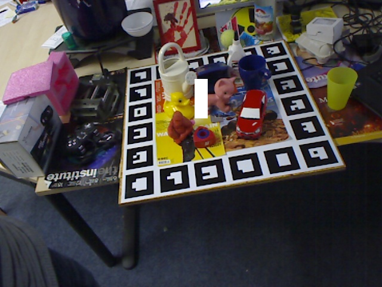

### image: (half of the obj is occluded)  

  

### ori detector: threshold 84 + nms  

  

### set low response closer to 0  

  

### scale experiment

Firstly we train templates by rendering img from 600mm, while obj is
about 1000mm in scene. As is expected, our ori detector fails:  
  

### ori low to 0 version(simi drops off course)

### scale template at each match position, good but 10 times slower

### histogram + 1D nms to find primary depth  

  
As we can see, the template is trained from 600mm. We use histogram + 1D nms to
find possible depth in scene, in this case we find 5 possible depths, and
successfully, 1000mm is one of them. Matching time is about 60ms now.  

todo: more than 64 features. need to modify
similarity(local), and addSimilarities(delete 8u 8u), and distinguish them
because use 16 sse may be slower than 8 sse  
DONE